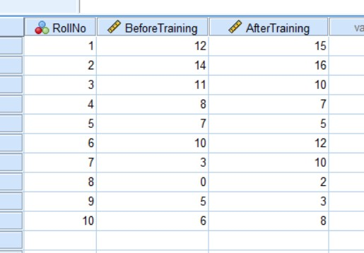
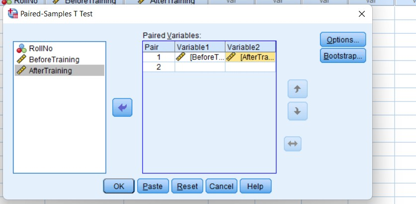
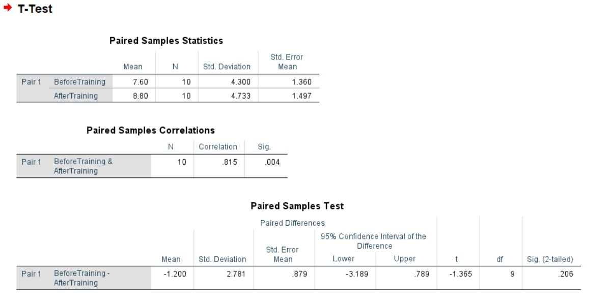

# Two Sample T test

- the number of datasets must be equal

## Steps

_for example of data set:_

Memory capacity of 10 students was tested before and after training, state whether the training was effective of not from the following scores.

| Roll No.        | 1     | 2     | 3     | 4     | 5     | 6     | 7     | 8     | 9     | 10    |
| --------------- | ----- | ----- | ----- | ----- | ----- | ----- | ----- | ----- | ----- | ----- |
| Before Training | 12    | 14    | 11    | 8     | 7     | 10    | 3     | 0     | 5     | 6     |
| After Training  | 15    | 16    | 10    | 7     | 5     | 12    | 10    | 2     | 3     | 8     |

- Goto variable view and add the variables

- Goto data view and add the given data.

  

- Click on **Analyze** tab, **Compare Means** and **Paired-Samples T test**.

  

- Add the required variable in **Dependent List** and click **Paste** or **OK**.

  

  - Add before to variable1
  - Add after to variable2

- Required Output:

  
